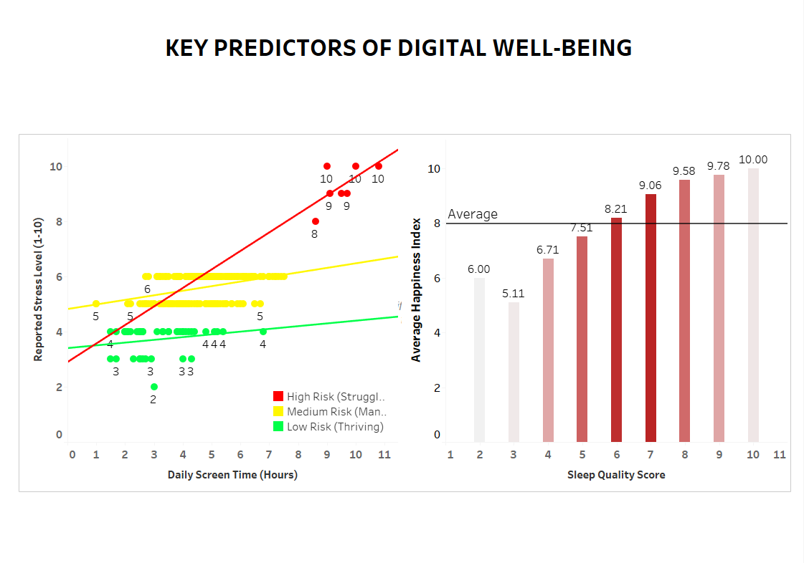
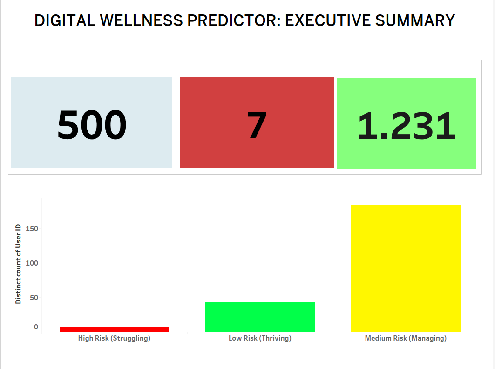
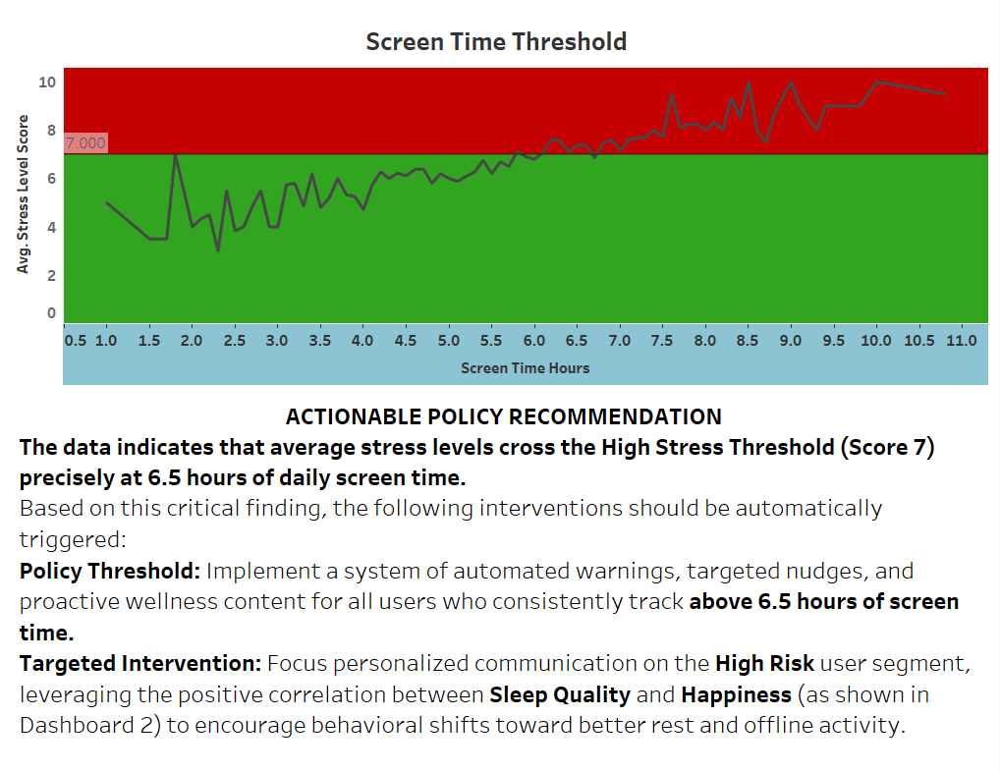

# 📊 Digital-Wellness-Data-Analysis  
### *Tableau Dashboard for Correlation and Platform Analysis on Mental Health & Social Media Balance*

---

## 🧠 **Digital Wellness Report: Correlation & Platform Risk Analysis Dashboard**

### 📘 **Project Overview & Business Value**
This project leverages **Excel-based analysis** to build a **two-page Business Intelligence dashboard** in **Tableau**.  
The goal is to uncover **data-backed insights** into how **social media usage behaviors** and **platform engagement** affect **Happiness Index** and **Stress Level** scores.  

This report serves as a foundation for:
- Developing **effective digital wellness policies**
- Designing **targeted interventions**
- Promoting **healthy digital habits**

---

## 📈 **Page 1: Executive Correlation Summary**

This page focuses on the **statistical relationship** between key digital usage metrics and reported **Happiness Index** values — visualized through **correlation matrices** and **predictor dashboards**.

### 🔍 **Key Analytical Takeaways**

**📉 Primary Risk Factor (Strong Negative):**  
- **Daily Screen Time** shows the strongest **negative correlation** with the **Happiness Index** (**-0.74**)  
- This indicates a **highly predictive inverse relationship** — as daily screen time increases, reported happiness **significantly decreases**.

**💤 Mitigating Factor (Strong Positive):**  
- **Sleep Quality Score** demonstrates a **strong positive correlation** (**+0.81**) with the **Happiness Index**  
- High-quality sleep is the **strongest predictor** of elevated happiness and well-being.

**📊 KPI Summary:**  
- **500 users surveyed**  
- **7 High-Risk individuals identified**  
- **Average Digital Balance Score:** `1.231`

---

## ⚙️ **Page 2: Actionable Policy — The Screen Time Threshold**

This section explores **wellness scores across platforms** and identifies the **critical screen time threshold** beyond which stress levels rise sharply — forming the basis for **automated policy interventions**.

### 🧩 **Actionable Policy Recommendation**

**Critical Finding:**  
- Average **Stress Level Scores** begin to **exceed the High Stress Threshold (Score 7)** at approximately **6.5 hours of daily screen time**.

**🔔 Policy Threshold:**  
Implement **automated interventions** for users consistently exceeding **6.5 hours/day**, including:
- Timely **wellness warnings**
- **Personalized nudges**
- Delivery of **wellness-focused content**

**📱 Platform Risk Insights:**  
- **Instagram** and **Facebook** exhibit the **highest average stress levels**  
- Interventions should **prioritize these platforms** through:
  - Usage limits  
  - Positive content redirection  
  - Encouraging off-screen activities

---

### 🧭 **Outcome & Impact**
This analysis provides a **quantitative foundation** for digital wellness strategies — bridging behavioral data and actionable policy.  
It empowers organizations to **protect user well-being** through **data-driven decisions** and **responsible technology design**.

---

*Created with ❤️ using Excel and Tableau.*
programmatic alerts.
